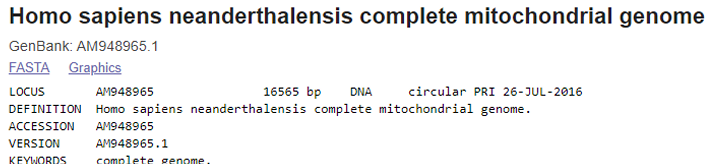
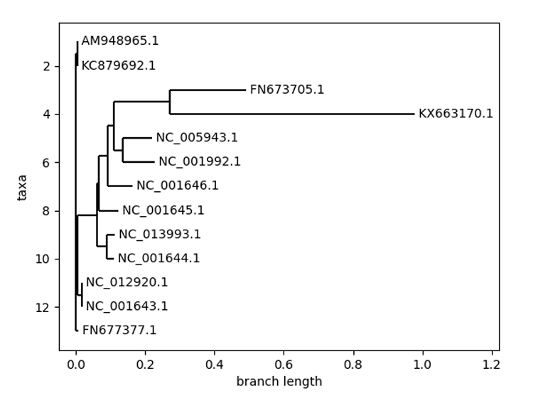

# Genetic Data Analysis with BioPython

## About Project

This repository contains a project created for genetic data analysis using BioPython. In this project, various genetic sequences have been merged, aligned, and a phylogenetic tree has been constructed. 

## Biological Databases and Technologies

Biology is a fundamental science that helps us understand the structures and processes of life. Modern biology is advancing in genetics and molecular biology. These advancements are based on biological databases and advanced technologies. Databases contain information such as DNA and protein structures, which are crucial for understanding diseases and developing new drugs. Bioinformatics utilizes computer technologies and algorithms to effectively use these databases.

To carry out our project, we needed data. In this project, we used sequences from humans, Neanderthals, Denisovans, and various primate species. We obtained our data from one of the most widely used biological databases, NCBI.

**If you are interested in biological databases and the technologies used, you can find more in the report.**

### You can follow these steps to download data from NCBI in fasta format:

1. It is a database created by NCBI, which is based in America. It is completely public. It allows searching for and DNA sequencing a specific gene. In addition to general information about the gene, it also presents articles and updates related to the gene.

[NCBI/Genbank] (https://www.ncbi.nlm.nih.gov/genbank/)

2. When you first visit the site, you see a database list on the left. For example:
- Pubmed: Contains articles on interactions in biological systems.
- Protein: Database for information on specific proteins.
- Nucleotide: Used to find sequences of genes or entire genomes of viruses.

  * You can also search by ID. For example, like the sequence AM948965. After typing ID in the search box, the screen will display information related to the genome.

  

3. Here, you can click on "FASTA" to view the mitochondrial DNA sequence and use it in your projects.

## What is Biopython?

BioPython is an open-source Python library developed for biological computations. It provides modules and tools that facilitate bioinformatics operations such as reading, writing, and processing DNA, RNA, and protein sequences.

# Phylogenetic tree

If you examine and run the project's code (this process may take some time), you will obtain the following tree view. The process of constructing a phylogenetic tree is an important method used to understand the evolutionary relationships between species and examine genetic diversity. This process involves collecting, aligning, selecting evolutionary models, constructing the tree, and evaluating the reliability of the tree using DNA, RNA, or protein sequences of relevant species or genes.

